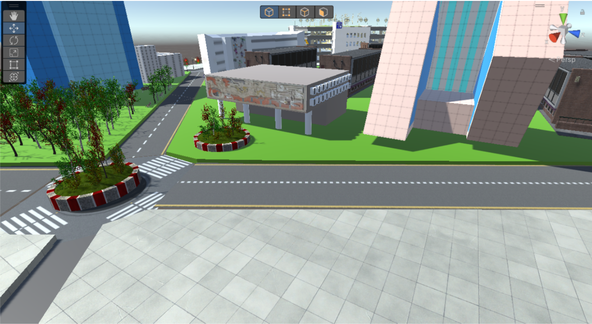

# Unity-Agentes

Creado por :

Roberto Calleja Pedraza A01024834 / Andrés Fuentes Alanís A01177466 / Andrea Catalina Fernández Mena A01197705 / Ana Fernanda Chacón Lomelí A00830052 / Alexa Sofía Arreola Alvarado A01177452
 
Programa en Unity que crea un modelo a escala del distrito Tec. Es complemento del programa https://github.com/Fuentes2395/PythonModelTrafficTec

Referencias y paquetes importados:
<ul>
 <li>Modular Lowpoly Street: https://assetstore.unity.com/packages/3d/environments/urban/modular-lowpoly-streets-free-192094</li>
 <li>Low Poly Cars: https://assetstore.unity.com/packages/3d/vehicles/land/low-poly-cars-101798</li>
 <li>Parking Garage - Complete: https://assetstore.unity.com/packages/3d/environments/urban/parking-garage-complete-104909</li>
 <li>Low Poly Street Pack: https://assetstore.unity.com/packages/3d/environments/urban/low-poly-street-pack-67475</li>
 <li>Urban building: https://assetstore.unity.com/packages/3d/props/exterior/urban-building-130318</li>
 <li>White City: https://assetstore.unity.com/packages/3d/environments/urban/white-city-76766</li>

</ul>

